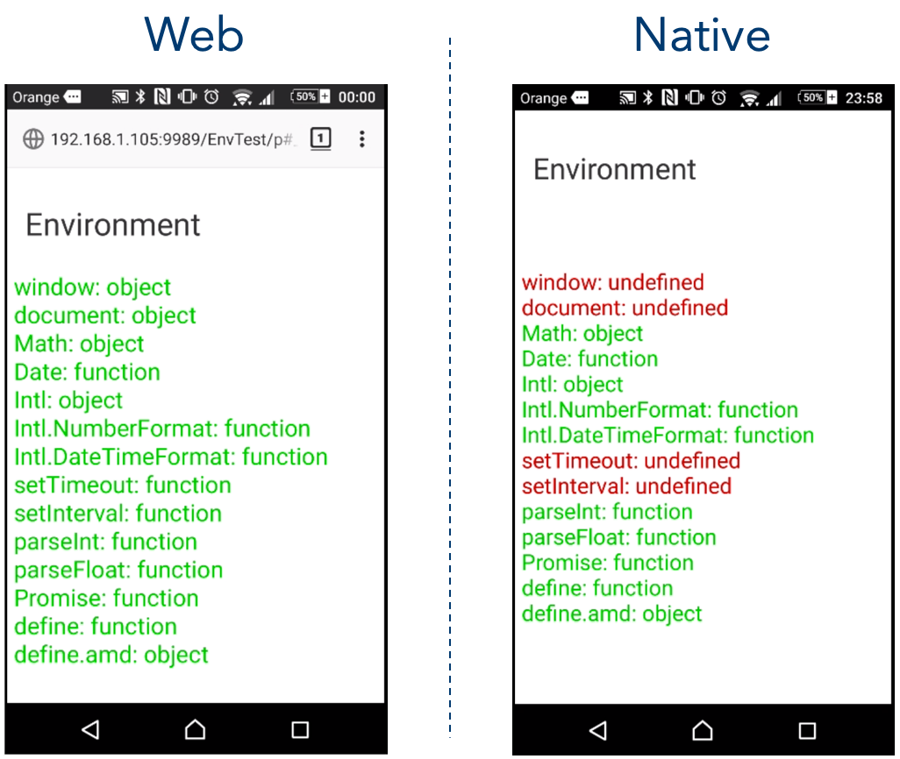

# Environment Test Project

Explore what's available in the execution environment of a Quantum Visualizer project.
You might be wondering how much of ES6 is available, whether there's a DOM,
whether `Math` or `Intl` are defined and so on. This project aims to help
you answer those questions.

Here's a pic of a comparison of the end result between Web and Native:

